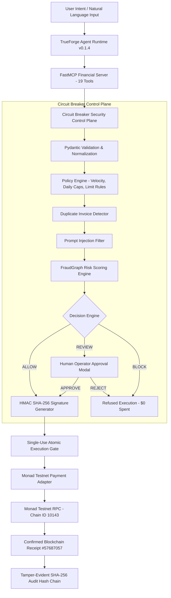

# Circuit Breaker — System Architecture Specification

> **"TrueForge provides the AI agent harness and tool orchestration layer. Circuit Breaker provides the deterministic financial execution firewall."**

---

## 1. High-Level Architecture Overview

Circuit Breaker decouples non-deterministic natural-language reasoning from deterministic financial tool execution. The agent can discover tools and propose actions, but signing authority over money is strictly gated by an independent security engine.

---

## 2. Component Breakdown

### A. TrueForge Agent Harness (Port 8790)
- **Role:** Session management, natural-language prompt interpretation, and skill pack discovery (`trueforge/skills/circuit-breaker-finance/SKILL.md`).
- **Isolation:** TrueForge holds no private keys or signing authority.

### B. FastMCP Financial Tools (19 Tools)
- **Role:** Standardized Model Context Protocol (MCP) server running over stdio transport (`mcp/financial_server/server.py`).
- **Categories:**
  - **READ ONLY (11 tools):** `get_wallet_address`, `get_wallet_balance`, `get_supported_networks`, `get_transaction_status`, `verify_audit_chain`, `get_action_details`, `get_policy_rules`, `get_counterparty_risk`, `get_pending_approvals`, `get_system_health`, `get_fraud_graph_edges`.
  - **PREPARATION (7 tools):** `estimate_transfer`, `prepare_transfer`, `request_transfer`, `propose_payment`, `simulate_transfer`, `approve_action_human`, `get_counterparty_risk`.
  - **EXECUTION (1 tool):** `execute_payment` — requires valid HMAC token.

### C. Circuit Breaker Policy Engine
- **Role:** Independent FastAPI backend security control plane (`backend/app/engine/decision_engine.py`).
- **Evaluations:** Max transfer limit ($50,000 / 5000 MON), daily velocity limit, duplicate payment detection, FraudGraph risk score, prompt injection keyword filter.

### D. HMAC Authorization & Single-Use Execution Gate
- **HMAC Token:** Computes HMAC-SHA256 signature over canonical JSON action digest (`token_id:action_id:action_hash:decision:issued_at:expires_at`).
- **Atomic Reservation Lock:** Lifecycle state transition (`ISSUED → RESERVED → CONSUMED`) guarded by `threading.Lock`. Prevents replay and 20-thread concurrency race conditions.

### E. Monad Testnet Payment Adapter
- **Adapter:** `MonadTestnetAdapter` (`backend/app/execution/monad_testnet_adapter.py`).
- **Network:** Monad Testnet (`Chain ID 10143`, native asset `MON`, RPC `https://testnet-rpc.monadexplorer.com`).
- **Key Isolation:** Private key (`TESTNET_PRIVATE_KEY`) is stored strictly in root `.env` and is **never** returned over API responses or MCP tool outputs.
